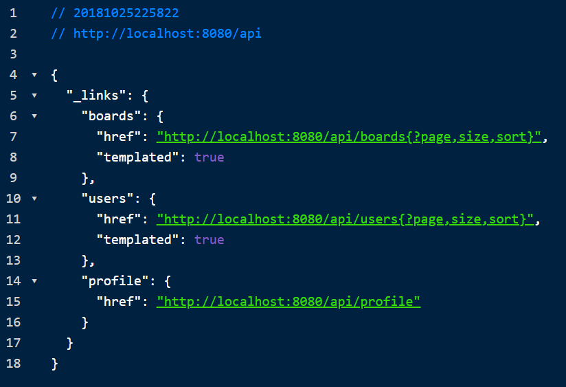

# Spring-boot-data-rest 를 이용한 RestAPI 만들기.

## 1. Maven Dependencies 추가

web, rest, jpa, h2, lombok 추가

```xml
    <dependencies>

        <dependency>
            <groupId>org.springframework.boot</groupId>
            <artifactId>spring-boot-starter-web</artifactId>
        </dependency>

        <!-- 이번 장 핵심ㅋㅋㅋ data-rest 를 이용한 rest api 만들기.-->
        <dependency>
            <groupId>org.springframework.boot</groupId>
            <artifactId>spring-boot-starter-data-rest</artifactId>
        </dependency>

        <dependency>
            <groupId>org.springframework.boot</groupId>
            <artifactId>spring-boot-starter-data-jpa</artifactId>
        </dependency>

        <dependency>
            <groupId>com.h2database</groupId>
            <artifactId>h2</artifactId>
        </dependency>

        <dependency>
            <groupId>org.projectlombok</groupId>
            <artifactId>lombok</artifactId>
        </dependency>

        <dependency>
            <groupId>org.springframework.boot</groupId>
            <artifactId>spring-boot-starter-test</artifactId>
        </dependency>

    </dependencies>
```

&nbsp;
&nbsp;

## 2. Domain 생성 (User, Board)

MVC 방식의 RestAPI 만들 때와 같이 도메인 만들어 줌.

[User.java](./src/main/java/me/bactoria/user/User.java)

[Board.java](./src/main/java/me/bactoria/board/Board.java)

&nbsp;
&nbsp;

## 3. Reopository 생성 (UserRepository, BoardRepository)

Repository에 `@RepositoryRestResource` 를 붙여줌.

`HATEOAS` 도 설정됨.

&nbsp;

**UserRepository.class**

```
@RepositoryRestResource
public interface UserRepository extends JpaRepository<User, Long> {
}
```

&nbsp;

**BoardRepository.class**

```
@RepositoryRestResource
public interface BoardRepository extends JpaRepository<Board, Long> {
}
```

&nbsp;
&nbsp;

## 4. User, Board 샘플 데이터 생성

눈으로 확인하려면 샘플데이터가 필요함.

**ApplicationRunner** 를 사용해서 만듬.

Board에는 User 정보가 필요하므로 `@Order` 를 이용하여 User 생성을 먼저 하도록 함.

&nbsp;

[CreateUserRunner.java](./src/main/java/me/bactoria/runner/CreateUserRunner.java)

[CreateBoardRunner.java](./src/main/java/me/bactoria/runner/CreateBoardRunner.java)

&nbsp;
&nbsp;

## 5. base path 설정

**application.properties**

```properties
spring.data.rest.base-path=api

spring.h2.console.enabled=true
```

기본 path 를 api 로 하겠다.

=> localhost:8080/api

(추가로, h2 콘솔로 확인하기 위해서 콘솔 설정도 했음.)

&nbsp;
&nbsp;

## 6. Application 실행.

Application을 실행시킨 후에

http://localhost:8080/api 로 접속해보자.



라고 뜨면 정상적으로 실행된 것이다.

**HATEOAS** 가 적용된 것을 볼 수 있다.

&nbsp;

이번엔 http://localhost:8080/api/users 로 접속해보자.

(user가 아니라 user임!)

&nbsp;

.PNG)

&nbsp;

비밀번호가 노출되므로 별도의 설정이 필요하다. (다으메..)

밑으로 내려보면 

&nbsp;

.PNG)

&nbsp;

페이징 처리 되어서 나오는 것을 알 수 있다.

**HATEOAS** 에다가 **Page** 까지.. 좋은 것 같다.

&nbsp;

페이징 관련 설정은 application.properties에서

`spring.data.rest` 쪽에서 변경할 수 있다.

&nbsp;

기본적으로 페이지 사이즈가 20이기 때문에 유저가 20개가 찍혔다.


